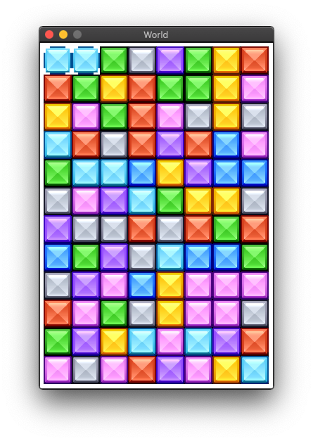

# racket-candy-crush

Candy Crush tutorial in Racket

Tutorial to create a Candy Crush clone using the Racket programming language. 
This tutorial is based on the PygameZero Candy Crush tutorial I wrote.

Status: early draft, probably lots of bugs. Feel free to add them as issues. 

https://racket-candy-crush.readthedocs.io/en/latest/
