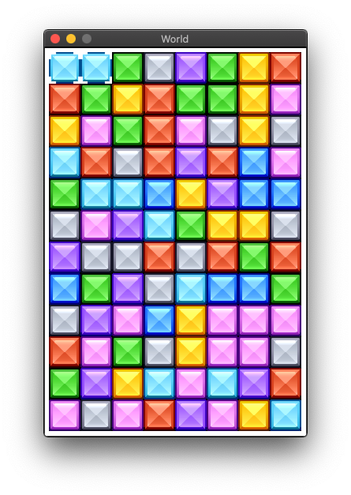

.. Racket Candy Crush Tutorial documentation master file, created by
   sphinx-quickstart on Tue Mar  2 21:33:16 2021.
   You can adapt this file completely to your liking, but it should at least
   contain the root `toctree` directive.

Welcome to Racket Candy Crush Tutorial!
=======================================

In this tutorial we're going to create a Candy Crush clone using the Racket
programming language.

Install Racket
--------------

Download and install Racket from the official website: https://download.racket-lang.org/

Download the images
-------------------

Download the tutorial images by |location_link|. You can close that
page once the download finishes. Make a directory for your game and
copy the images from the **images.zip** file you just downloaded into
this directory.

.. |location_link| raw:: html

   <a href="https://kinolien.github.io/gitzip/?download=https://github.com/ericclack/racket-candy-crush/tree/master/images" target="_blank">clicking this link</a>

Start the tutorial
------------------

.. toctree::
   :maxdepth: 2
   :caption: Contents:

   intro
   part1
   part2

Get in touch
------------

We would love to hear how you've got on with this tutorial or receive
any other feedback. Get in touch with the author: |author|

Indices and tables
==================

* :ref:`genindex`
* :ref:`modindex`
* :ref:`search`

  
